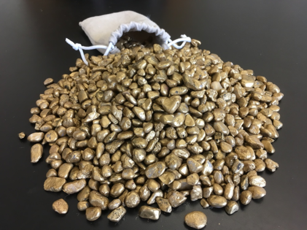

# CS50 final project - Nuggets



[:arrow_forward: Discovery of gold in the tunnels under Dartmouth.](https://dartmouth.hosted.panopto.com/Panopto/Pages/Viewer.aspx?id=8a39c7da-7208-46b4-9c8d-ad2101450924)

## The game

Your team will develop the code for the *Nuggets* game, according to the [Requirements Spec](REQUIREMENTS.md).

* All teams shall implement the game server.
* Teams of 4 students shall also implement the game client.
* We provide a starter kit via GitHub Classroom.
* Your team shall follow the [Git Flow](https://www.cs.dartmouth.edu/~cs50/Lectures/units/git-flow.html) style of git management.
* Your team shall use the [Scrum](scrum.md) style of project management.
* Good design, good style, good documentation, and good testing are expected.
* Consider the [characteristics of a successful team](https://www.cs.dartmouth.edu/~cs50/Activities/teamwork/index.md).

:arrow_forward:
You may find this [demo video](https://dartmouth.hosted.panopto.com/Panopto/Pages/Viewer.aspx?id=dbece9b4-30f1-49ab-8669-ad220160f0f0) to be helpful.

## Starter kit

When you accept the assigment using the GitHub Classroom (using the link in Canvas), you will be asked to join an existing team or to create a new team.
Please coordinate with your teammates to ensure that your team is registered just once.
One member should **immediately** configure your repo to [protect the main branch](https://www.cs.dartmouth.edu/~cs50/Lectures/units/protect-main.html).
All members of the team should then clone the team's new repository, which includes the starter kit.

## Submissions

*Deadlines are provided on the [course website](https://www.cs.dartmouth.edu/~cs50/schedule.html).*

### Design spec

Your design document (written in Markdown) shall describe the major design decisions, plan for testing, and the roles of each member of your group.
*For each of the two programs,* the document should describe the

* User interface (including command-line parameters and stdin/stdout/graphical interface);
* Inputs and outputs;
* Functional decomposition into functions/modules;
* Major data structures;
* High-level pseudo code (plain English-like language) for logic/algorithmic flow;
* Testing plan, including unit tests, integration tests, system tests.

Recall the lecture unit about Design; it has a section about [design specs](https://www.cs.dartmouth.edu/~cs50/Lectures/units/design.html#design-spec).
As examples, see the design specs provided as part of the TSE.
**Do *not* repeat elements of the [Requirements Spec](REQUIREMENTS.md)**; just refer to it as needed.

**How to submit:**
Commit a file `DESIGN.md` and any associated files.
Your spec may include diagrams; be sure to commit them.
Before the deadline, [push a branch called 'submit-design'](https://www.cs.dartmouth.edu/~cs50/Labs/submit.html).
*Make sure your Markdown renders properly on GitHub!*

### Design review

At a time and place to be announced, your group will present your design to the us (professor and TA).
You have 10 minutes to present, and then we have 10 minutes for Q&A.
If you are late for your presentation, you have less time to present to us.
(Don't be late.)

In 10 minutes you must present an *overview* of your design decisions and how your group will divide the work; the design document provides more detail.
Be prepared to answer questions and receive feedback.

<!-- ***Bring two printed copies of your design with you to the meeting.*** -->

### Implementation spec

You must submit an Implementation spec (written in Markdown): a summary of your approach to implementing the server (and client, for teams of 4) and any modules, providing the prototype and brief description of each function, and specifics of the data structure(s) you plan to use.
You do not need to describe the `support` library or, if you use it, `libcs50`.

Recall the lecture unit about Design; it has a section about [Implementation specs](https://www.cs.dartmouth.edu/~cs50/Lectures/units/design.html#implementation-spec).
Of those details, your implementation spec should describe all of your implementation's units (other than those we provide), provide pseudo code for each unit's functions (including prototypes and their parameters), and describe every major data structure.
As examples, see the implementation specs provided as part of the TSE.

**How to submit:**
Commit a file `IMPLEMENTATION.md` and any associated files.
Your spec may include diagrams; be sure to commit them.
Before the deadline, [push a branch called 'submit-implementation'](https://www.cs.dartmouth.edu/~cs50/Labs/submit.html).
*Make sure your Markdown renders properly on GitHub!*

### Final submission

Everything -- all code and documentation -- must be pushed to GitHub by the deadline.
***Do not wait to the final minutes before the deadline;***
you are far more likely to make a mistake, and have no time to correct it.
Plan to submit everything several hours before the deadline.

**How to submit:**
Commit all necessary files.
Before the deadline, [push a branch called 'submit-final'](https://www.cs.dartmouth.edu/~cs50/Labs/submit.html).

We will grade the version of the code in the branch `submit-final` at the time of the deadline; if no such branch appears until later you will ***lose 10 points per hour after the deadline***.
Specifically, we take 10 points per hour, prorated by the minute, which means that you lose (10/60 x minutesPastDeadline) points off your total project grade.
No extensions will be permitted.

**What:** Your GitHub project shall include all necessary source and documentation files.

 1. Your code should be well-organized with sensible filenames and subdirectories.

 2. There shall be a Makefile for each library (if any), and a top-level Makefile to build the client and server and (recursively) any necessary libraries.
We must be able to `make clean` and `make all` from the top-level directory and result in a complete compilation.

 3. All code must compile (with no warnings) on the CS50 Linux servers with the usual CFLAGS.
The programs must run without segfaults.
They must not have memory leaks as determined with `valgrind` (exception: leaks directly attributable to ncurses).
They must not output anything to stdout, other than what is required to play the game, though they may use the `log` module and send that output to either `stderr` or to a file.
There can be at most *one* global variable in each program as described [below](#global-variables).

 4. There shall be a `README.md` file in each subdirectory (explaining the purpose of that subdirectory and its contents), and a `README.md` file in the top directory (naming all group members and summarizing the purpose of each subdirectory).

 5. There shall be documentation, with (at least)
    * `README.md` files, as noted above.
    * `DESIGN.md`, optionally updated from the version you submitted earlier.
    * `IMPLEMENTATION.md`, which *must* be updated from the version you submitted earlier and *shall* identify and describe your program(s) and all modules you wrote.	No need to describe the libraries we provide.
    * `TESTING.md`, that describes how you tested your modules and programs.
    * any images or files needed to render the above documents; we recommend keeping such files in an `images/` subdirectory.
    * any other documentation you find it useful to include.

 6. There shall be at least one new, non-trivial, map in the `maps/` directory.
We'd like to play on a map of your design!

 7. The GitHub repository shall be 'clean'.
That is, it should not contain any 'derived files' (those built by `make` and removed by `make clean`), any 'scratch files' (including editor backup and autosave files), any core dumps, etc.

You may prepare your final presentation materials after the deadline, up to the moment you present.

### Final presentation

At a time and place to be announced, your group shall present your solution to us (professor and TA).
You have 10 minutes to present, and then we have 10 minutes for Q&A.
If you are late for your presentation, you have less time to present to us.
(Don't be late.)

You shall present

 * A brief demonstration of your solution.
 * A summary of your implementation decisions.
 * Any limitations of your current implementation.

All group members should have a speaking role in this oral presentation.
You are encouraged to use other media (e.g., textual outline, hand-drawn diagrams, or Powerpoint slides);
if so, you must DM those materials to Professor and TA immediately prior to your presentation. <!-- @update -->
<!-- if so, you must bring **two printed copies** for us to peruse during the presentation. -->

### Grading

Your final project will be graded out of 100 as follows:

 * **15**: Design spec & presentation
 * **15**: Implementation spec
 * **15**: Code style and quality
 * **15**: Final presentation
 * **10**: Scrum and Git practices
 * **30**: Functionally correct and complete
 * **-10** (off the top) ***per hour*** if submitted late

***See the [grading rubric](rubric.md).***

Furthermore, immediately after the project you will each complete a confidential online survey in which you comment on your contribution to the project, and the contributions from members of your group; the Professor uses the information in that survey to set part of your overall course grade (recall the [grading policy](https://www.cs.dartmouth.edu/%7Ecs50/Logistics/#grades)).

---

## Design hints

Consider these thoughts while you develop your design spec.

### Grid

The game is played on an *NR x NC* grid of gridpoints.
How will you represent the grid?
How will the client and/or server use the grid?
What functions must a "grid" support?
This is a critical design decision, and one I spent a lot of time considering before I started writing code.
I started one approach to the representation and implementation of a grid, and later switched to another approach... but because I'd wrapped the entire approach in an abstract `grid` module, *none of the code that used the grid needed to change.*

The right representation of a grid can make your code vastly simpler than it would be if you choose other representations.
Consider:

* What information must the *spectator* keep about the state of the game?
* What information must the *player* keep about the state of the game?
* What information must the *server* keep about the state of the game?
* What information does the string below record about the state of the game?
* What information does the string below **not** record about the state of the game?
* How much gold is in each pile... and does any player know until they step on a pile?
* Do these questions give you ideas about how to store game state?

```c
char* grid = ...;   // a string variable
puts(grid);         // produces the output below
```
```
  +----------+
  |..........|                 +---------+
  |..........###################.........|
  |..........|                 +-----#---+
  +---------#+                       #
            #                        #
            #  +-----------+         #
            ####...........##############
               |...........|
               +-----------+
```

### Keep it simple

As I mulled over design choices, and implementation choices, a question frequently appeared in my head: *but won't that approach be inefficient, in either time or memory? what about this other approach, that would be more efficient?*
I always opted for the simpler approach.  Always.
This philosophy meant I was able to write the code faster, debug it more easily,  test it more reliably, and reach a correct outcome sooner.
And, my code is shorter and easier to read than it would be in a complex approach.

Later, if I discovered the inefficient approach was too slow, or too bloated, for the game's purposes, I could make a branch and explore an optimization of some component or algorithm.
But I've not had the need, or the time, to do so.

### Keyboard input

The client needs to read and react to keystrokes immediately... but all of the code we've seen in CS50 cannot read any input from stdin (when it is a keyboard) until the user hits Return.
In other words, the keyboard is normally in "line-oriented mode".
Your client program needs it in "character-oriented mode", technically called "cbreak" mode.

No problem.
The *ncurses* library provides that feature ([see below about ncurses](#ncurses)).
As a design hint, just be confident that you can read one character from the keyboard when told that stdin has input ready, and know that your program will not block (get stuck) waiting for the user to hit a key.

The message module (part of the starter kit) provides you a way of looping forever, waiting for input to be ready on stdin or on the network, and calling you when either occurs.
Thus, you need not worry about how to know when to read stdin, or how to know when a message arrives.

## Implementation hints

Consider these thoughts while you develop your implementation spec.

### Iterative development

I cannot emphasize this point enough: write, test, and commit a minimal program, then incrementally add capabilities, bit by bit.
(Indeed, when following the git-flow approach, your *main* branch should always contain a clean, submittable, runnable program.)
My first server did little more than parse its arguments and exit zero on success, non-zero with error messages on an invalid command-line. *Commit.*
Then I added code to initialize a grid, print it out, and exit. *Commit.*
Then I added a loop to read a line from stdin, and handle it as if it were a message from a client; at first, it could handle only "QUIT". *Commit.*
Later I added networking.
And so forth.

*I made 97 commits on my solution before the project was released to students.*

Each one provided a bit more functionality, or improved unit tests, or improved commenting, or refactored some function that had grown too large.
In a few cases, I started down some path and then decided it was a bad direction... so I used `git checkout` to revert to the prior commit, and start over.

As you plan your implementation, think about this *iterative development* approach.
What features will you add first?
What can be added later?
How will you be sure to always have a clean, tested, runnable, submittable, project?
(use git-flow.)

### Comment (and log) as you go

I could have written my solution faster.

But I chose to keep my code fully commented, as I wrote;
 to keep those comments up to date, as I made changes;
 to add logging outputs at all critical points in the code;
 to add defensive checks for every function argument, as I wrote the function;
 and
 to add defensive checks for every function that could return an error.

This choice made a huge difference, even though I was the sole developer and even though I never stepped away from coding for more than 24 hours.
The act of writing comments (for an imaginary reader to see) helped me to think more clearly about what the code was supposed to do, and helped me later remember what each piece of code was doing.
The comments actually helped me remember the "contract" between caller and function.
The defensive checks actually helped catch bugs that would otherwise have led to obscure incorrect behavior or to segmentation faults.

It's worth writing the comments and defensive code *as you write the functional code.*

### Break down big functions

Review the [unit](https://www.cs.dartmouth.edu/~cs50/Lectures/units/cohesion.html) about *cohesion* and *coupling*, and think about the content and role of each function you write.
If a function starts to get large, break it down into smaller functions.
I found this to be particularly important for my `handleMessage` functions, because there are multiple message types and every message needs to be handled in a different way.
Thus, my `handleMessage()` became a really short `if... then... else if... else if... else` structure, wherein each "then" and "else" block was a single statement: calling a `handleXYZ()` function that was specifically focused on handling only that `XYZ` type of message.
Those functions were sometimes really short - just one or two lines - but the code was much easier to read.
(They also make great breakpoints in gdb!)

### Encapsulate message detail

Where possible, use functions to encapsulate the details involved in sending a message.
I found it helpful to write a small function `sendXYZ()` for each type of message `XYZ`, to allow that function to check parameters, construct the message, log about it, and send the message.
These functions were often short, and (in some cases) called from multiple points in my program, avoiding the risky practice of repeating the code.
They also provide an explicit counterpart to the `handleXYZ()` calls in the other program.
(They also make great breakpoints in gdb!)

### Use the logging module

Although use of the logging module is optional, you will find it helpful.
Insert calls to `log_x()` at critical points in your code, and you'll be able to study a logfile after (or during!) a particularly confusing or buggy run, to see what happened.

[:arrow_forward: Video demo](https://dartmouth.hosted.panopto.com/Panopto/Pages/Viewer.aspx?id=c5c70b23-d618-44bb-93f6-ad2e0159e0ed)

### Unit testing

As I noted above, the [grid](#grid) is an incredibly important design and implementation choice.
I wrote my grid module first, before writing a single line of code for the server or client.
And, I wrote a glass-box unit test for the grid module in parallel with writing the module itself.
This decision took time - but saved me a ton of time later.
Once I had a solid, working grid module I was able to write the server and client without having to think about how the grid worked (or whether it worked!).
Sure, I occasionally had to go back and extend my grid module with a new parameter here or a new function there, to better fit the needs of the server, but I was able to incrementally test those additions with my unit test.

Consider the same approach for any unit you develop.

### Style

Your implementation shall follow [CS50 style guidelines](https://www.cs.dartmouth.edu/~cs50/Labs/CodingStyle.html).
As noted in under the [grading](#grading) heading, a substantial portion of your project grade rests on style.
You may want to peruse this [list of the most common style-related comments applied to final projects in recent years](style.md).

### Global variables

In the [unit](https://www.cs.dartmouth.edu/~cs50/Lectures/units/cohesion.html) about *cohesion* and *coupling*, we noted that global *variables* are a bad form of coupling.
Global *constants* are a good thing, and fairly common.
Declare them as `static const ...` to ensure they cannot be changed, and ensure they are local to this particular file.

There are, however, some occasions when a judicious use of global *variables* can make the code cleaner and easier to read.

I found it useful to declare a *single* global variable, a `struct` called `game`, in my client and in my server.
(Again, I declared it `static` so it would be global to this file, but not visible to other source files.)
I could thus refer to the members of that struct in various points throughout the server or client code, e.g., `game.goldRemaining`.
The presence of `game.` makes it clear to the reader that this variable is global, not some variable local to the function.

The alternative - and actually, my initial approach - was to allocate a `struct` called `game` in my `main()` function, and then pass it around through every function call in the program.
Yes, that avoided the use of the global variable, but it meant every function had to have a parameter `game_t *game` and to check `if (game==NULL)` before proceeding.
That code was much less readable, so I ripped it all out and made that `game` a global.

**Your code can have at most *one* global variable in each program.**
The above `struct {...} game` approach counts as one variable.
(You can have multiple global constants, but only one global variable.)

### Message module

The core of our provided support library is the `message` module, provided in the `support` directory of the starter kit.
It enables applications to send and receive network messages and also handle keyboard input, without dealing with gory details of sockets and without need for threads.

[:arrow_forward: Video walk-through](https://dartmouth.hosted.panopto.com/Panopto/Pages/Viewer.aspx?id=f8811bb1-0fec-4c05-8a46-ad2201693f7f).

### nCurses

The client shall use the *ncurses* library to arrange its interactive display; see the [unit about ncurses](https://www.cs.dartmouth.edu/~cs50/Lectures/units/ncurses).
Note:

* ncurses has ["still reachable" memory leaks](https://invisible-island.net/ncurses/ncurses.faq.html#config_leaks); ignore them.
* if the user starts with a window too small for the grid size, your client shall prompt the user to increase the window to a size big enough for the grid - repeatedly if necessary.
* if the user later shrinks the window too small for the grid, your client need not discover this change nor deal with it.


### Parsing messages

Your server and client will need to parse messages it receives from the *message* module.
All messages start with a word; in most cases, that word is followed by a space or newline.
I found it convenient to use `strncmp` and `strlen`, like this:

```c
  if (strncmp(message, "PLAY ", strlen("PLAY ")) == 0) {
    const char* content = message + strlen("PLAY ");
    ... work with content...
  } else...
```

See `man strncmp`; notice that the above compares only the first five characters of the `message` with the constant string `"PLAY "`.
Notice also that I include the space in that string, to ensure I'm catching the entire word, and not considering, for example, `"PLAYER"` to match `"PLAY"`.
Notice also that it's easy to create a string pointer that points into the middle of the message, i.e., to the start of the content after `"PLAY "`.

### Random numbers

See the [unit](https://www.cs.dartmouth.edu/~cs50/Lectures/units/random) about random numbers.

### libcs50

Although our solution does not use anything from libcs50, you are welcome to use it in your solution.
Copy whatever you need from the TSE starter kit into your nuggets repo.

### Converting from letters to numbers, and back

It's worth remembering that computers represent characters, as with everything else, as numbers.
All modern computers use the [ASCII standard code](http://www.asciitable.com) for encoding common characters.
Notice that the capital letters are a contiguous range of codes from 65 to 90.
In C, we can do arithmetic on characters; thus

```c
int playerNumber = 2;  // i.e., the third player
char playerLetter = 'A' + playerNumber; // i.e., 'C'
```

or, if you start with a letter,

```c
char playerLetter = 'D';
int playerNumber = playerLetter - 'A';  // i.e., 4
```

I found it useful to write little inline functions to convert from a player number to a player letter, and vice versa.

### The switch statement

See the [unit](https://www.cs.dartmouth.edu/~cs50/Lectures/units/c-flow.html#switch) about the `switch` statement, which is particularly useful when you have a long list of cases that can be described by a simple comparison.
For example,

```c
char letter = ...;
switch (letter) {
case 'A': ... code for letter=='A'; break;
case 'B': ... code for letter=='B'; break;
case 'C': ... code for letter=='C'; break;
default:  ... code for letter not matching any case above.
}
```

The above is equivalent to (but more readable than)

```c
char letter = ...;
if (letter == 'A') {
	code for letter=='A';
} else if (letter == 'B') {
	code for letter=='B';
} else if (letter == 'C') {
	code for letter=='C';
} else if
	code for letter not matching any case above.
}
```

Switch can be used with any ordinal type (at least: `int` and `char`).

If you take this approach, I strongly recommend keeping the code for each case really short, perhaps even just one statement like a function call.

### Lines of code

My solution is not really all that big; you code will likely be shorter because my solution supports features (like 'bot' mode) that yours will not.

**All code specific to Nuggets:**
	`cloc *.[ch] support/{log,message}.[ch]`

Language|files|blank|comment|code
:-------|-------:|-------:|-------:|-------:
C|6|361|855|1944
C Header|4|62|310|90
SUM:|10|423|1165|2034

**Nuggets, excluding the support code:**
	`cloc *.[ch]`

Language|files|blank|comment|code
:-------|-------:|-------:|-------:|-------:
C|4|294|606|1544
C Header|2|35|120|48
SUM:|6|329|726|1592


**For reference, my Tiny Search Engine (without libcs50):**
	`cloc common/*.[ch] crawler/crawler.c indexer/index*.c querier/querier.c`

Language|files|blank|comment|code
:-------|-------:|-------:|-------:|-------:
C|8|251|440|980
C Header|3|23|77|30
SUM:|11|274|517|1010

As you can see, my code is heavily commented: about half the lines of code are comments!

These reports come from the excellent [cloc](https://github.com/AlDanial/cloc) tool, installed on plank.


### Testing and tools

You may run your `player` or `server` on any Linux server in the [Thayer collection](https://www.cs.dartmouth.edu/~cs50/Logistics/systems.html#linux), simply by giving the server's hostname on the player's commandline.
Run a server on `babylon5` and a player on `plank`, and you're playing over the real network!

We installed four programs in the shared directory `~/cs50-dev/shared/nuggets/`:

* `player` - our player.
* `server` - our server (which goes beyond spec to validate mapfile).
* `padmap` - a tool to pad all lines of a mapfile so they have the same length.
* `checkmap` - a tool to validate whether a mapfile is 'valid'.

You can run them directly by giving their pathname; for example,

```bash
~/cs50-dev/shared/nuggets/linux/server ...
~/cs50-dev/shared/nuggets/linux/player ...
~/cs50-dev/shared/nuggets/linux/checkmap maps/main.txt
~/cs50-dev/shared/nuggets/linux/padmap maps/draft.txt > maps/new.txt
```

There is a set compiled for MacOS, as well.

On Linux, you may want to make a convenience symlink:

```bash
# create a convenience symlink:
ln -s ~/cs50-dev/shared/nuggets/linux prof
# then you can run our binaries with less typing, e.g.,
prof/padmap maps/draft.txt > maps/new.txt
```

#### Bot mode

Our client (`player`) has a special capability: it can run as a *bot*, that is, as an automated player.
This capability goes 'beyond the spec' but I found it useful for testing the server, and also a lot of fun to watch.
If you give the name `bot` as the `playerName`, it will periodically send random movement keystrokes to the server; you can just sit and watch the bot play the game!
If you give the name `botbg` as the `playerName`, it will play as a bot but *not display anything*, which makes it suitable to run in the background.
I demonstrate both types of bot in the video below. 

[:arrow_forward: Video demo of 26 bots and a spectator](https://dartmouth.hosted.panopto.com/Panopto/Pages/Viewer.aspx?id=a04097c4-1b8e-4147-b525-ad26017d839f)
