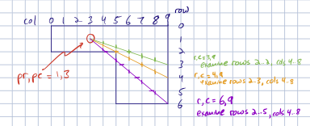
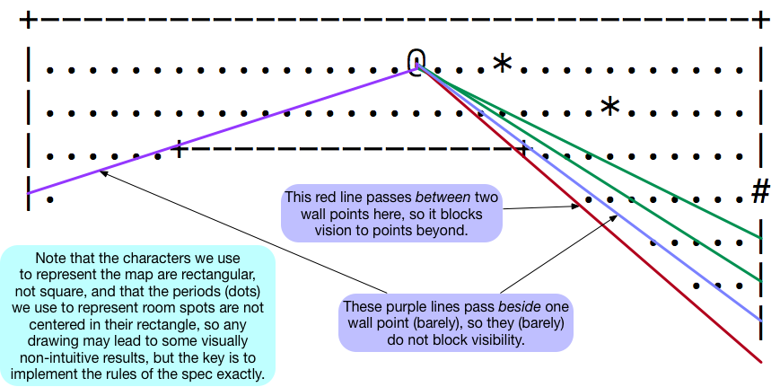

# Nuggets - Requirements Spec
### David Kotz - May 2019, 2021

A multi-player exploration game, *Nuggets*, in which a game server maintains all game state, and one or more game clients display the game to a player.
The object of the game is to collect more gold nuggets than any other player.
The game ends when all gold nuggets have been collected by some player.

* The *server* is a program that implements all game logic.
* The *client* is a program that allows a human to join the game as either *player* or *spectator*.
* A game includes zero to *MaxPlayers* players, and zero or one spectators.
* Thus a game involves one server and [0..MaxPlayers+1] clients.
* Game play occurs in a set of interconnected *rooms* and *passages*, laid out on a rectangular grid of *gridpoints*, as defined by a [map](#maps).
* Gridpoints within a room or passage are called *spots*.  A *room spot* can be occupied by a player or a gold pile, or be empty.  A *passage spot* can be occupied by a player or be empty.
* At game start time, `GoldTotal` nuggets are randomly dropped in a random number of random-sized piles, each pile at some spot in a room.  Gold nuggets are indistinguishable; a pile contains at least one nugget.
* A new *player* is dropped into a randomly selected empty room spot.
* A new player initially has 0 nuggets in its *purse*.
* A player can *see* the spots and boundaries that are [*visible*](#visibility) from its current location.
* A player can *see* the occupants of only those spots that are [*visible*](#visibility) from its current location.
* A player can *know* the spots and boundaries of all rooms and passages it has seen since the player began playing.
* The spectator immediately *knows* and always *sees* all gridpoints.
* The *display* is an ASCII screen large enough to represent the entire grid.
* At any given time, a player's display illustrates all known gridpoints and visible occupants; the spectator's display illustrates all gridpoints and all occupants.
* A player moving into a spot containing a pile of gold *collects* that gold, adding all the pile's nuggets to the player's purse. The pile is then gone and that pile's spot is then empty.
* A player moving into a spot occupied by another player causes the two players to switch places.
* The game *ends* when all gold nuggets have been collected.
* At end, the game announces to all players (and spectator, if any) the size of each players' purse; the player(s), spectator, and server then quit.

## Constants

The game has several parameters; although other values are reasonable, we specify the following.

```c
MaxNameLength = 50;   // max number of chars in playerName
MaxPlayers = 26;      // maximum number of players
GoldTotal = 250;      // amount of gold in the game
GoldMinNumPiles = 10; // minimum number of gold piles
GoldMaxNumPiles = 30; // maximum number of gold piles
```

> Implementation note: consider defining these as file-local global variables with `static const int`.

The *message* module also imposes a maximum size for each message; see `support/message.h`.

## Server

	./server map.txt [seed]

The server ***shall***

1. Start from the commandline of the form above; thus the first argument is the pathname for a [map file](#map-files) and the second argument is an optional seed for the random-number generator; if provided, the seed must be a positive integer.
2. Verify its arguments; if error, provide a useful error message and exit non-zero.
2. If the optional seed is provided, the server shall pass it to `srand(seed)`.  If no seed is provided, the server shall use `srand(getpid())` to produce random behavior.
3. Load the designated map file; the server may assume it is [valid](#valid-maps).
4. Initialize the game by dropping at least `GoldMinNumPiles` and at most `GoldMaxNumPiles` gold piles on random room spots; each pile shall have a random number of nuggets.
5. Initialize the network and announce the port number.
6. Wait for messages from *clients* (players or spectators).
7. Accept up to *MaxPlayers* players; if a player exits or quits the game, it can neither rejoin nor be replaced.
8. Accept up to 1 spectator; if a new spectator joins while one is active, the server shall tell the current spectator to quit, and the server shall then forget that current spectator.
7. React to each type of inbound message as described in the [protocol](#network-protocol) below.
8. Handle errors, including malloc failures, gracefully.
8. If a player quits the game, that player's symbol is removed from the map.
8. Update all clients whenever any player moves or gold is collected.
8. Monitor the number of gold nuggets remaining; when it reaches zero, the server shall prepare a tabular summary (below), send a `QUIT` message (to all clients) with that summary, print the summary, and exit.

The game-over summary shall be the phrase "GAME OVER:" followed by a simple textual table with one row for every player (including any who quit early) and with three columns: player letter, player purse, and player name.

The server ***shall not*** print anything to stdout other than what is required for game play.

The server ***should*** log useful information that can be saved in a logfile;
a typical approach would be to log to stderr and thus usage could be:

	./server 2>server.log map.txt

## Client

	./player hostname port [playername]

The client allows a human to join the game as *player* or *spectator*.
The client ***shall***

1. start from the commandline of the form above; thus the first argument is the hostname or IP address where the server is running, and the second argument is the port number on which the server expects messages; the third (optional) argument determines whether to join as a *player* or *spectator*.
2. Verify its arguments; if error, provide a useful error message and exit non-zero.
2. If the `playername` argument is provided, the client joins as a *player* and can interactively play the game.
3. If the `playername` argument is not provided, the client joins as a view-only *spectator*.
4. Initialize the display.
5. Initialize the network and join the game with a `PLAY` or `SPECTATE` message accordingly.
6. Upon receipt of a `GRID` message, ensure the display is large enough for the grid (it should be *NR+1* x *NC+1* for best results).
7. Show a status line on the first line of the display, as noted in the [protocol](#network-protocol) below.
8. Show the game grid on the subsequent lines of the display, as noted in the [protocol](#network-protocol) below.
9. Update the display any time new information arrives from the server.
8. Handle errors, including malloc failures, gracefully.
9. Quit the game (by sending `KEY Q`) if reaching EOF on stdin.
9. Quit when told to do so by the server, as noted in the [protocol](#network-protocol) below.
9. Display a brief note on the status line if an unknown or malformed message arrives from the server.
10. Print a Game-over summary and exit, as noted in the [protocol](#network-protocol) below.

The client ***shall not*** print anything to stdout other than what is required for game play.

The client ***should*** log useful information that can be saved in a logfile;
a typical approach would be to log to stderr and thus usage could be:

	./player 2>player.log hostname port playername
	./player 2>spectator.log hostname port

### Client interface

The display shall consist of *NR+1* rows and *NC* columns.
The client program shall ensure the window is large enough: if not, it shall inform the user about the necessary window size, and wait for the user to enlarge the window.
(If the user later shrinks the window during game play, your client need not discover this change nor deal with it.)

The top line of the display shall provide game status; for a player, it should look like this:

	Player A has 39 nuggets (211 nuggets unclaimed).

If other information needs to be displayed briefly, it is placed on the right:

	Player A has 39 nuggets (211 nuggets unclaimed).  GOLD received: 39

	Player A has 39 nuggets (211 nuggets unclaimed).  unknown keystroke

The spectator's status line should look like this:

	Spectator: 211 nuggets unclaimed.

**Grid display:**
The remaining *NR* lines present the grid using *map characters:*

 * ` ` solid rock - interstitial space outside rooms
 * `-` a horizontal boundary
 * `|` a vertical boundary
 * `+` a corner boundary
 * `.` an empty room spot
 * `#` an empty passage spot

or *occupant characters:*

 * `@` the player
 * `A`-`Z` another player
 * `*` a pile of gold

**Spectator keystrokes:**
The spectator can type

 * `Q` quit the game.

**Player keystrokes:**
The player can type

 * `Q` quit the game.
 * `h` move left, if possible
 * `l` move right, if possible
 * `j` move down, if possible
 * `k` move up	, if possible
 * `y` move diagonally up and left, if possible
 * `u` move diagonally up and right, if possible
 * `b` move diagonally down and left, if possible
 * `n` move diagonally down and right, if possible

* where *possible* means the adjacent gridpoint in the given direction is an empty spot, a pile of gold, or another player.
* for each move key, the corresponding Capitalized character will move *as far as possible* automatically and repeatedly in that direction, until it is no longer possible.

The four movement keys are shown relative to the player (@) below.

|     |     |     |
|:---:|:---:|:---:|
|  y  |  k  |  u  |
|  h  |  @  |  l  |
|  b  |  j  |  n  |


## Maps

A *map* defines the set of rooms and passages in which the game is played.

### Valid maps

* The *map* is laid out on a *grid*.
* The grid is *NR* rows by *NC* columns; thus there are *NR x NC* *gridpoints*.
* The grid will fit in a `DISPLAY` message; thus, *NR x NC + 10 < message_MaxBytes*.
* The grid has enough spots to accommodate *MaxPlayers* players and `GoldMaxNumPiles` gold piles.
* A *room* is an [axis-aligned rectilinear polygon](https://en.wikipedia.org/wiki/Rectilinear_polygon); it may have hole(s).
* A *spot* is a gridpoint in the interior of a room or along a passage.
* A room is defined by its *boundaries*.
* A horizontal boundary always meets a vertical boundary at a corner boundary.
* Thus, the *boundaries* of rooms are not spots, nor are gridpoints outside rooms and passages.
* A *passage* is one-spot wide and connects rooms to other rooms and passages. Passages are rectilinear but may not be straight, that is, they may have 90-degree turns.
* A passage interrupts a room's vertical or horizontal boundary; a passage never meets a room at a corner.
* The map is one connected component; thus, one can reach any spot from any other spot by moving in some sequence of up,down,left,right.

* Every gridpoint is one of these characters:
   * ` ` solid rock - interstitial space outside rooms
   * `-` a horizontal boundary
   * `|` a vertical boundary
   * `+` a corner boundary
   * `.` an empty room spot
   * `#` an empty passage spot


### Map files

A *map file* is a text file with exactly *NC* lines and in which every line has exactly *NR* characters.

> Your solution may assume all map files are [valid](#valid-maps), but must infer *NR* and *NC* by reading the file.


### Example map

The following is a valid 21x79 map.
The dots represent empty spots; gold pieces and players may occupy these.
The hashes represent passageways; players may occupy these.
One room is non-convex.
Some passageways bend, and some fork.
Some rooms have multiple entrances.
The room at upper-left shows a passage to nowhere.

```
  +----------+
  |..........|                 +---------+
  |..........####              |.........|                +-------+
  |..........|                 +-----#---+                |.......|
  +---------#+                       #              #######.......|
            #                        #              #     +---#---+
            #  +-----------+         #     +--------#+        #
            ####...........##############  |.........|        #
               |...........|            #  |.........|        #
               +-----------+            ####.........|        #
                                           +----#----+        #
                                                #    +--------#--+
     +---------------------------------+        #    |...........|
     |.................................|        ######...........|
     |.................................|        #    |...........|
     |......+---------------+..........|        #    |...........|
     |......|               |..........##########    +-----------+
     |......|               |..........|
     |......|               |..........|
     |......|               |..........|
     +------+               +----------+
```

## Visibility

Assume a player is at gridpoint *(pr,pc)*.
Another gridpoint *(r,c)* is "visible" from point *(pr,pc)* by reviewing the *base map*.
(Occupants do not affect visibility.)
Consider the mathematical line segment from *(pr,pc)* through *(r,c)*.
Considering each row between *pr* and *r* (exclusive), and each column between *pc* and *c* (exclusive); if the line segment intersects a gridpoint exactly, and that gridpoint is not a 'room spot', then it blocks the player's vision; if the line segment passes *between* pairs of map gridpoints and if *both* those gridpoints are not 'room spots', then they block the player's vision.
Only if there are no such blocking pairs do we conclude that point *(r,c)* is visible.
Note these specs imply you cannot see down a passage, because passage spots are not room spots; think of the rooms as well-lit and the passages as dark.



[:arrow_forward: Video explanation](https://dartmouth.hosted.panopto.com/Panopto/Pages/Viewer.aspx?id=3cc64f9b-8aee-4250-ab58-ad3001076aeb)

> One small mistake in the video: at the end I got `row--` and `row++` backward; note that row numbers count downward from the top of the screen.

Another example, from the Example map shown in the prior section.
At game start we are in the big room with two gold piles in sight:

```
     +---------------------------------+
     |.................@...*...........|
     |..........................*......|
     |......+---------------+..........|
     |.                        ........#
                                  .....|
                                    ...|
                                       |
```

Consider some of the line segments that may be drawn toward the right and left walls:




Now move one step to the right, and we can see a bit more of the floor:

```
     +---------------------------------+
     |..................@..*...........|
     |..........................*......|
     |......+---------------+..........|
     |.                        ........#
                                 ......|
                                   ....|
                                     ..|
                                       +
```

Now three more steps to the right; we pick up gold, and see a new pile of gold around the corner:

```
     +---------------------------------+
     |.....................@...........|
     |..........................*......|
     |......+---------------+..........|
     |.                      .*........#
                              .........|
                              .........|
                               ........|
                               --------+
```

Now one more step to the right; we still can't see the vertical wall below us:

```
     +---------------------------------+
     |......................@..........|
     |..........................*......|
     |......+---------------+..........|
     |.                      .*........#
                             ..........|
                             ..........|
                             ..........|
                             ----------+
```

Move over and down to align with the passage:

```
     +---------------------------------+
     |.................................|
     |..........................*......|
     |......+---------------+..........|
     |.                     |.*.......@#
                            |..........|
                            |..........|
                            |..........|
                            +----------+
```

Step into the passage, but we can only see one step in front of us:

```
     +---------------------------------+
     |.................................|
     |..........................*......|
     |......+---------------+..........|
     |.                     |.*........#@#
                            |..........|
                            |..........|
                            |..........|
                            +----------+

```

Key `L` and `K` sprint to the right and up, along the passages and across the next room.

```
                                           +--------#+
                                           |....@....|
                                           |.........|
                                           #.........|
                                           +----#----+
                                                #
     +---------------------------------+        #
     |.................................|        ##
     |.................................|        #
     |......+---------------+..........|        #
     |.                     |..........##########
                            |..........|
                            |..........|
                            |..........|
                            +----------+

```

The display still shows the first room - though only the spots and boundaries we had seen at some time, but none of the gold we left behind.
It shows one spot of the passage we passed along the way, because it was visible from the passage as we passed by.

We follow the passage to the right and up; just before we enter the room, we can see the last passage spot and the adjacent wall and corner, but not into the room.
(Although this may seem counter-intuitive, per the specs the passage spot blocks our vision into the room.)

```
                                                          |
                                                    #####@#
                                                    #     +
                                           +--------#+
                                           |.........|
                                           |.........|
                                           #.........|
                                           +----#----+
                                                #
     +---------------------------------+        #
     |.................................|        ##
     |.................................|        #
     |......+---------------+..........|        #
     |.                     |..........##########
                            |..........|
                            |..........|
                            |..........|
                            +----------+
```

One more step right and we can see most of the new room:

```
                                                           -------+
                                                          |.......|
                                                    ######@..*....|
                                                    #     +---#---+
                                           +--------#+
                                           |.........|
                                           |.........|
                                           #.........|
                                           +----#----+
                                                #
     +---------------------------------+        #
     |.................................|        ##
     |.................................|        #
     |......+---------------+..........|        #
     |.                     |..........##########
                            |..........|
                            |..........|
                            |..........|
                            +----------+

```


## Network protocol

The network protocol connects zero or more game *clients* (players and spectator) with one game *server*.
The server maintains all game state; the clients display the game state to a user, and sends their keystrokes to the server; the server sends back updated displays.

> The protocol runs over UDP/IP, that is, the *user datagram protocol* over the *Internet Protocol*.
> [UDP/IP](https://en.wikipedia.org/wiki/User_Datagram_Protocol) and [TCP/IP](https://en.wikipedia.org/wiki/Transmission_Control_Protocol) form the core of the Internet.
> In either protocol, communication occurs between two endpoints; the address of an endpoint is a pair *host IP address*, *port number*.
> UDP carries *datagrams* from one port on one host to another port on another host (well, they could be the same host).
> A datagram can hold [zero to 65,507 bytes](https://en.wikipedia.org/wiki/User_Datagram_Protocol).

Our game sends one *message* in each datagram.
Each message is an ASCII string (text).
Most messages are on one line and have no terminating newline.
Some messages are multiple lines long.
Newlines are shown explicitly as `\n` in the specs below.
The first word of the message indicates the type of message.
(The first word begins at the start of the datagram and is terminated by a space, a newline, or the end of the message.)
Message types are in ALL CAPS.

When the server starts, it shall open a new endpoint and announce its port.
When the client starts, it shall send a message to the hostname (or address) and port number where the server awaits.
The client can join in one of two roles: *players* and *spectators*; let's look at the messages each can send, then at the messages a server can send.

### Player to server

When a *player* client starts, it shall send a message to the server:

	PLAY real name

Everything after the `PLAY` and one space is captured as the player's "real name" (free text, optionally including spaces).

If there are already *MaxPlayers* players,  the server shall respond with

	QUIT Game is full: no more players can join.

If the player's `real name` is empty (no non-space characters), the server shall respond with

	QUIT Sorry - you must provide player's name.

See below for how a player should handle receipt of `QUIT` messages.

Otherwise, the server shall add the player to the game.
The server shall store the `real name` for later use in a game-over summary, after (1) truncating an over-length `real name` to `MaxNameLength` characters, and (2) replacing with an underscore `_` any character for which both `isgraph()` and `isblank()` are false.
The server shall then respond with

	OK L

where `L` is this player's letter in the set {`A`, `B`, ... `Z`}.

The server shall then immediately send `GRID` and `GOLD` messages as described below.

The client sends, at any time,

	KEY k
	
where k is the single-character keystroke typed by the user.

When the player's keystroke causes them to collect gold, the server shall inform all clients using a `GOLD` message as described below.

When the player's keystroke causes them to move to a new spot, the server shall inform all clients of a change in the game grid using a `DISPLAY` message as described below.

### Spectator to server

When a *spectator* client starts, it shall send a message to the server:

	SPECTATE

to join as a spectator.
If there is already a spectator, this spectator takes its place
(the server sends a `QUIT` message to the prior spectator, then forgets it).
Thus, the server tracks only one spectator at a time.

The server shall respond with a `GRID` message as described below.

The server shall then immediately send a `GOLD` message as described below.

The spectator is not assigned a letter and is not represented on the map.

The only keystroke allowed for spectators is `'Q'` for quit.

Subsequent `DISPLAY` messages will include a complete view, as if this client *knows* all and *sees* all.

### Server to clients

The server shall send immediately to new clients,

	GRID nrows ncols

where `nrows` and `ncols` are positive integers describing the size of the grid.
This size will never change.

The server shall send immediately to new clients, and at any time to all clients,

	GOLD n p r

where `n`, `p`, and `r` are positive integers,
to inform the player it has just collected `n` gold nuggets, its purse now has `p` gold nuggets, and there remain `r` nuggets left to be found.
The value of `n` may be zero.
The value of `p` shall be initially zero, but will increase when gold is found.
The spectator shall always receive `n=0`, `p=0`.

The server shall send immediately to new clients, and at any time to all clients,

	DISPLAY\nstring
	
where the `DISPLAY` is separated from the `string` by a newline, and the `string` is literally a multi-line textual representation of the grid as known/seen by this client.
(Indeed, if you were to just print the message string, it would be recognizable as the game map.  That's why DISPLAY ends with newline, and why the string contains an embedded newline after each row.)
More precisely, `string` has `nrows` lines, each of which has `ncols` characters plus a newline.
Each client receives a different version, because (a) the spectator knows all and sees all, but is not itself represented on the map, (b) players' displays show only the boundaries and spots they know and the occupants visible from their current position, and (c) the player's own position is represented by `@`.
Note it is entirely the server's responsibility to produce these display strings.

The server sends, at any time,

	QUIT explanation

where *explanation* is an arbitrary string, possibly multiple lines.
Upon receiving a `QUIT` message the client shall exit curses, print the explanation followed by a newline, and exit.

Four examples follow.

When a player quits,

	QUIT Thanks for playing!

When a spectator quits,

	QUIT Thanks for watching!

When a spectator is replaced,

	QUIT You have been replaced by a new spectator.

When all gold is collected,

```
QUIT GAME OVER:
A          4 Alice
B         16 Bob
C        230 Carol
```

### Malformed messages

Any message not following the above protocol, *exactly*, is malformatted.
Both client and server shall be robust in the face of malformatted messages - they should not crash, exit, or proceed incorrectly.
At a minimum they shall log an error and ignore the message.

The server *may* send, in response to the client,

	ERROR explanation

to indicate it was unable to understand or handle the client's prior message.
The remainder of the line provides a short explanatory text.
The client shall present this text to its user on the display's status line.

### Misordered messages

The server and client *may* strive to be robust in the face of missing, misordered, or repeated messages.

(A stronger spec would *require* robustness, but for this project we'll give you some slack.)

## Inspiration

This project was inspired by a classic game, [Rogue](https://docs.freebsd.org/44doc/usd/30.rogue/paper.pdf).

Why do we use the H-J-K-L keys?
Because [the original ADM3a terminal had arrows on them](https://catonmat.net/why-vim-uses-hjkl-as-arrow-keys).
