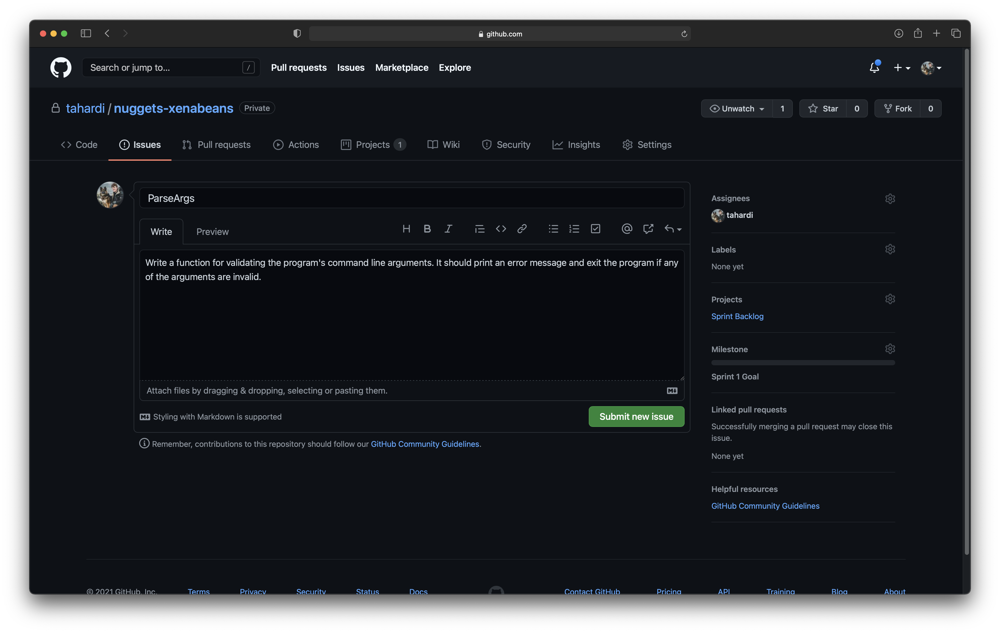
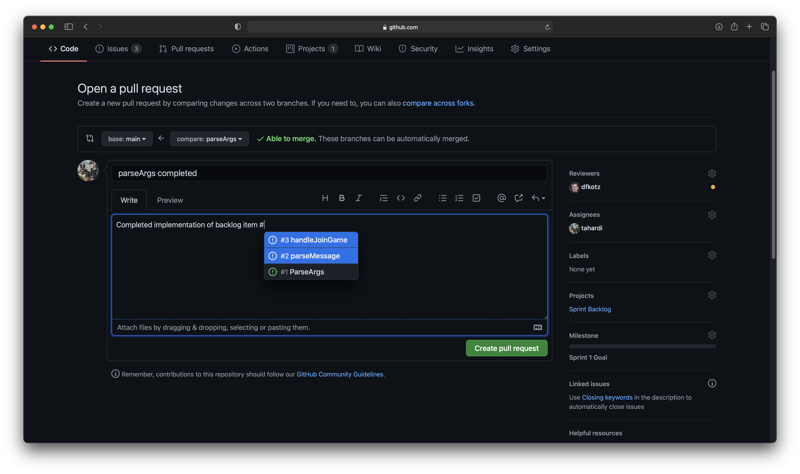
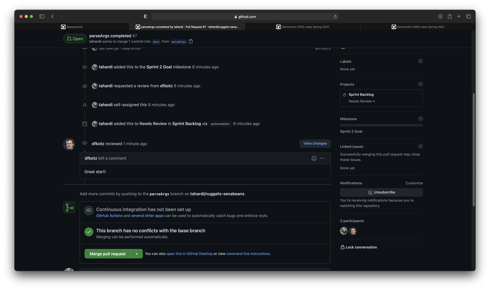

# Scrum in CS50

Your team will be working within a simplified version of the [Scrum framework](https://www.scrum.org/resources/scrum-guide?gclid=EAIaIQobChMIlonb_MP14QIVE-DICh3m3QxzEAAYASAAEgI8ifD_BwE) [[PDF](media/scrum/2020-Scrum-Guide-US.pdf)]
to effectively and efficiently develop and deliver incremental working versions of your final project.
Below we detail the terminology and methods of Scrum, as well as how they will integrate with your use of GitHub.

## Scrum

Scrum is an agile form of project management centered around transparency, inspection, and adaptation.

> **Transparent** because everyone on the team knows the status of all aspects.
> **Inspection** of team progress happens regularly and intentionally.
> **Adaptation** allows the team to adjust its goals and tasks periodically.

Scrum is based on core **values** of commitment, courage, focus, openness and respect.

Scrum is a timeboxed framework that begins with the **Sprint Retrospective, Sprint Review, and Sprint Planning** meetings.

These meetings provide teams time to reflect on their performance during the previous time period (**Sprint**), discuss potential improvements, and create a plan for achieving the upcoming **Sprint Goal**.

While teams have the freedom to decide what tasks needs to be done to accomplish the Sprint Goal, and how those tasks are assigned amongst team members, every team has a **Scrum Master** who is responsible for keeping teams on track during Scrum meetings and providing guidance where necessary.

First, some definitions:

* A ***Scrum Master*** is responsible for helping team members understand Scrum theory, practice, rules, and values.
They ensure that teams stay on topic during Retrospective, Review, and Planning meetings and ensure teams do not run over the allotted amount of time. **<u>Your Learning Fellow will serve as your Scrum Master.</u>**

* A ***Sprint*** is a period of time in which a subsection, or increment, of the required work for the project will be completed.
Some companies use sprints as long as a month, but **<u>we will use weekly sprints due to the small time scale of our project.</u>**

* A ***Sprint Goal*** is the project objective that the team aims to meet by the end of the Sprint by completing all of the items in the Sprint Backlog.
Due to the time constraints of the course, **<u>we will provide you with a goal for every Sprint, but your team will be responsible for creating an appropriate Sprint Backlog.</u>**

* The ***Sprint Backlog*** is the set of tasks that need to be accomplished during the Sprint period to achieve the Sprint Goal.
Each task should be a small, well-defined chunk of work that can be completed in a few hours' work by one person. 
**<u>Your team is responsible for generating this list of to-do items during the Sprint Planning meeting.**</u>

## Scrum Process

### Sprint Planning
This 20-minute meeting takes place at the beginning of a Sprint period, and seeks to answer the question: *what tasks are needed to achieve the Sprint Goal?*

The output of this discussion is a list of to-do items, known as the *Sprint Backlog,* and an assignment of one team member to each item.

### Sprint Retrospective
At the end of a Sprint period, your team spends 20 minutes reflecting on its performance and creating a plan for improvement during the next Sprint.
This meeting includes:

- Reflecting on the last Sprint with regards to people, relationships, processes, and tools;
- Identifying and ordering the major items that went well and potential improvements; 
- Laying out a plan for implementing improvements to the way the team does its work.

By the end of this meeting, your team should have generated a *Sprint Retrospective Report*, based on a template we provide.
Instead of saving each report as a markdown file, you will instead create a GitHub wiki page for each.

### Sprint Review
At the end of a Sprint period, your team spends 20 minutes discussing incomplete Sprint Backlog items.
For each incomplete item, why was it not completed?
Maybe it needs to be broken up into several smaller items during the next Sprint, or maybe it depends on some other item being completed that was not included in the previous Sprint Backlog.
The output of this meeting is an updated Sprint Backlog that will be input for the Sprint Planning meeting.

<!--  @update: we no longer use tags.
  At the end of this meeting, teams should create a tag for the finished Sprint in `main` if they have not done so already.
-->

### Daily Scrum
Your team will spend the first 15 minutes of each class on Wednesdays and Fridays discussing progress and any obstacles that are preventing you from completing Sprint Backlog tasks.

The 15-minute time limit will be enforced by Scrum Masters.
After the Daily Scrum, you should proceed to work on your Sprint Backlog items, or break off into smaller groups to finish discussing items from the Daily Scrum with relevant members.
Your team is encouraged to meet for a Daily Scrum on non-class days as well.

---

## Sprint timeline

We suggest the following timeline.

### Sprint 1 (May 10-17) <!-- @CHANGEME date -->

* **Monday:** Project Board and Sprint Planning
* **Wednesday:** Daily Scrum
* **Friday:** Daily Scrum

**Goals:**

* `DESIGN.md` complete
* `IMPLEMENTATION.md` drafted

### Sprint 2 (May 17-24) <!-- @CHANGEME date -->

* **Monday:** Sprint Retrospective + Review + Planning
* **Wednesday:** Daily Scrum
* **Friday:** Daily Scrum

**Goals:**

* First, a minimum server: allows players and spectators to join, move, and quit.
* Then, enhanced server: creates gold piles, allows players to collect gold, detects end of game, produces *Game Over* list.
* Client: joins as spectator, handles all message types from server.   (For teams of 4, only.)
* `IMPLEMENTATION.md` complete, ready for submission
* Update documentation to track changes in design, implementation, or testing plan.

### Sprint 3 (May 24-31) <!-- @CHANGEME date -->

* **Monday:** Sprint Retrospective + Review + Planning
* **Wednesday:** Daily Scrum
* **Friday:** Daily Scrum

**Goals:**

* Server: add 'knows' and 'sees' functionality.
* Client: add player behavior.  (For teams of 4, only.)
* Complete any other missing functionality.
* Write tools to assist in testing.
* Extensive testing to ensure all code meets spec.
* Complete required documentation.

### Final sprint (May 31 - June 1) <!-- @CHANGEME date -->

* **Monday:** Sprint Retrospective + Review + Planning

**Goals:**

* Review the [Final submission](#final-submission) checklist.
* Clean up your repository.
* Touch up all documentation.
* Touch up comments.
* Regression test, on the servers.
* Commit and push well before the deadline.
* Prepare your presentation.

## Wiki

During your Sprint Retrospective your team will fill out the Retrospective template that we have provided.
These retrospective documents will live in your repo's **GitHub Wiki page**.
To create a Wiki page for your Sprint Retrospective, follow the steps listed below.

1. From your repository GitHub page, click the "Wiki" tab near the top.
2. If this is your first retrospective, click "Create the first page". Otherwise, click "New Page" in the top right.
3. Copy and paste the [Markdown template](retrospective.md).
4. Fill out the template.
5. Title it "Sprint Retrospective N", where N is the current Sprint iteration.
6. Click "Save Page".

---

# GitHub Project Board

You will be using GitHub Project Board to manage your Sprint Backlog. Your Sprint Backlog is a list of items that your team needs to complete in order to meet the Sprint Goal. Each Sprint Backlog item will be represented by a GitHub Issue, and the set of issues that makes up your Sprint Backlog will be organized inside of your Project Board. Your Project Board will have four columns for organization that represent different stages of completeness:

* ***To Do*** newly created issues (backlog items) are automatically placed in this column. Issues should remain in this column until some team member begins work on it.
* ***In Progress*** this is the only column in the Project Board that is not automated. **You will need to manually move issues** from the *To Do* column into the *In Progress* column to indicate to your team that you have started working on it.
* ***Needs Review*** new pull requests are placed in this column, and should be associated with an issue. This column indicate that the author is ready for their teammates to review their finished work.
* ***Done*** issues are automatically moved here when their associated pull request has been merged and the issue closed. Issues in this column indicate that they have been fully tested, reviewed, and merged into the master branch.

Your Project Board setup should generally look like this:

## Setup Your Project Board
Follow the steps below to setup a project board for managing your Sprint Backglog items.

1. Navigate to your team's nuggets repo on GitHub, and in the repository menu bar click "Projects" then "Create a project". Fill out the forms the same way that I have in the picture below then click "Create project".

2. Next, we need to add columns to organize our Sprint Backlog items. Let's start with the "To Do" column; Click "Add a column". Name the column and then set "Preset: To Do". Finally, under "Move issues here when..." select both checkmark boxes.

3. Click "Add column" again, and name this column "In Progress". Leave it with the default automation setting "Preset: None" and click "Create Column".

4. Click "Add column" again, and name this column "Needs Review". Set "Preset: In progress" and under "Move pull requests here when..." select checkboxes: "Newly added", "Reopened", and "Pending approval by reviewer".

5. Finally, click "Add column" one more time and name this column "Done". Set "Preset: Done" and mark every checkbox.

6. Now that your project board is created, there is still one more thing you need to do before you can begin adding Sprint Backlog items to it. That is, you need to create a GitHub "Milestone" that represents the goal(s) of each of your 3 Sprints. Click the "Issues" tab in the top menu bar of your repository. Click the "Milestones" button (which is located next to the green "New Issue" button).

7. Click "New milestone" and then give it an appropriate name, due date, and description. Below is an example of a milestone for your Sprint 1 Goal.

8. Repeat the process in step 7 so that you end up with three milestones like the ones in the picture below.

## To Do

During your Sprint Planning meeting, you will be coming up with items for your Sprint Backlog. As you do this, you will be adding these items to your Project Board as ***GitHub Issues***. Below, we detail how to create an issue.

1. From your repository GitHub page, click the "Issues" tab near the top and then click "New Issue".
2. Give your issue an appropriate title and description.
3. If you already know which team member will be working on this issue, assign them to it using the menu on the right.
4. Assign this issue to your Sprint Backlog Project Board using the menu on the right.
5. Click on "Milestone" in the menu to the right and assign the issue to the current Sprint Goal.
6. Your new issue should look similar to what is shown below. Click "Submit new issue". Afterwards, you should see your newly created issue in the *To Do* column of your Project Board.

## In Progress

You should manually drag issues from the *To Do* column to the *In Progress* column to indicate to your team that you have begun work on them. You should also make sure to assign yourself to this issue if you have not done so already. From the Project Board, you can assign yourself by following these steps:

1. Click on the title of an issue (they are highlighted in blue), which will open menu bar to the right of the screen
2. Click on the "Assignees" button and find your GitHub account in the dropdown bar
3. Click anywhere else on the screen to get the dropdown bar to close
4. Close the menu bar using the "x" in the top right

**REMEMBER GIT FLOW** Moving an issue to *In Progress* indicates to your teammates that you are actively working on it. In terms of your git usage, this means that you should creat a new branch specifically for that issue where you will do all of your work. Later, after testing, you will create a pull request so that you team can review your work and merge it into master if satisfactory.

## Needs Review

After completing and **testing** your work for a specific issue, it is time to create a pull request to indicate that you are ready for your team to review your work.

1. Make sure that all of the work on your issue branch is committed and pushed
2. From your repository GitHub page, click the "Pull requests" tab near the top and then "New pull request"
3. At the top, you should see base: master <- compare: master. Click the "compare" dropdown bar and select the issue branch that you wish to create a pull request for. Then click "Create pull request"
4. Give your pull request a title and description. You can reference the issue it is associated with by using the syntax "#number", where number is the number of the issue.
5. Use the menu to the right to
    * assign your teammates as reviewers of your pull request
    * assign yourself as owner of the pull request
    * assign this pull request to your Backlog Project Board
    * assign this pull request to the current Sprint Goal

6. Your pull request should look similar to the one shown below. Click "Create pull request".

7. You should now see a pull request item in the *Needs Review* column of your Project Board. Note that your issue item may still be in the *In Progress* column. This is ok.

## Done

This column holds pull request items that have been merged to master and their associated issues that have been closed. The correct way for merging a pull request while simultaneously closing an issue is detailed below.

1. Make sure that your pull request has been reviewed and approved by your teammates. This process might require you to make changes to your code and request new reviews several times.
2. From your repository GitHub page, click the "Pull requests" tab near the top and click your pull request.
3. If your pull request has been approved, you should see a "Merge pull request" button at the bottom. Click it.
4. In the merge request description box, use the syntax "Closes: #number" to indicate the issue (or issues) that this pull request solves. It is very important that you use this syntax as it is what causes GitHub to automatically close issues for you. If you do this incorrectly, you will have to manually close your issue afterwards and move it to the *Done* section of your project board.
5. You should now see the pull request and issue items in the *Done* column of your Project Board.

